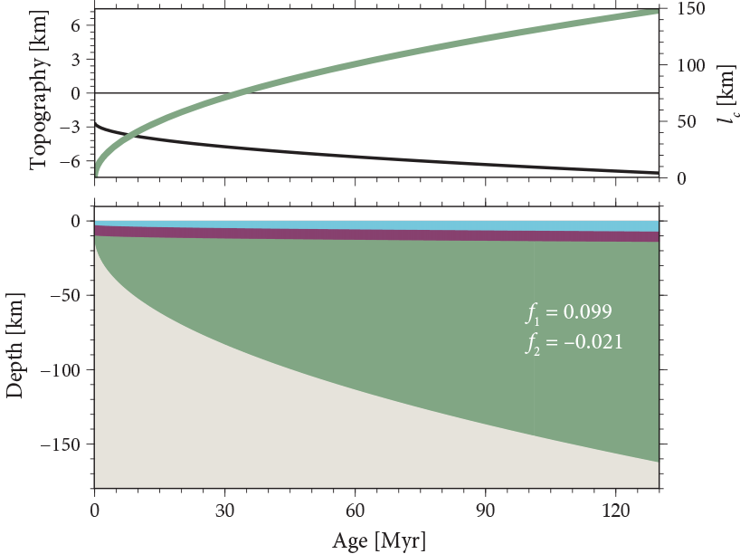
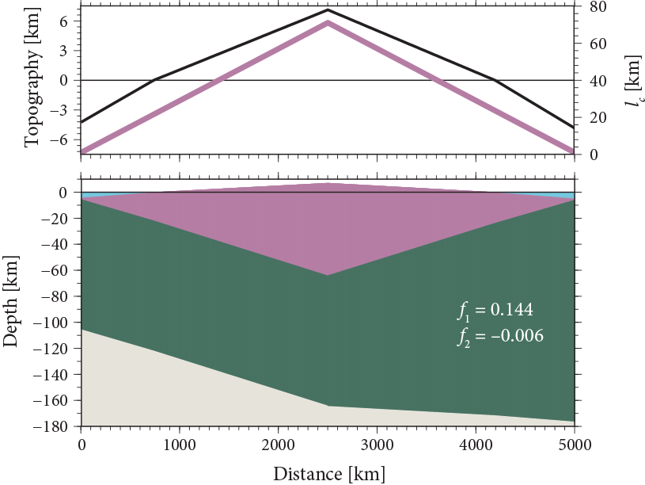

## Goals for this lesson

- Review various observables from Earth's surface and interior

## Topography {.smaller}

:::: {.columns}

::: {.column width="40%"}
![Topography of Earth, Venus, and Mars. Fig. 1.1 of Becker and Faccenna [-@Becker2025].](img/bf-f1.1.png){height="500"}
:::

::: {.column width="60%"}
- Topography provides insight into processes shaping planets' surfaces and interior dynamics
- In these planetary perspectives, the color scheme highlights landscape differences between nearby planets
- Plate tectonics plays a significant role shaping Earth's topography
:::

::::

## The role of isostasy {.smaller}

:::: {.columns}

::: {.column width="40%"}
![Isostatic balance for a lithospheric and asthenospheric column. Fig. 1.3 of Becker and Faccenna [-@Becker2025].](img/bf-f1.3.png){height="500"}
:::

::: {.column width="60%"}
- Much of the elevation difference between continental and oceanic regions on Earth can be related to **[isostasy]{style="color:teal;"}**
- At isostatic equilibrium, neighboring columns of rock will have equal pressure from the weight of the overlying rock at equal depth
- Mathematically, we can say

    \begin{equation}
    p_{l} = \rho g h = \int dz \rho(z) g(z)
    \end{equation}

    where $p_{l}$ is the lithostatic pressure, $\rho$ is rock density, $g$ is the acceleration due to gravity, $h$ is the thickness of rock, and $z$ is depth.
:::

::::

## Calculating isostatic equilibrium {.smaller}

![Crustal block floating on the mantle. Fig. 2.2 of Turcotte and Schubert [-@Turcotte2014].](img/ts-f2.2.jpg)

Let's consider a crustal block "floating" on the mantle.

- The crust “floats” because a typical crustal density $\rho_{\mathrm{c}}$ is ~2750 kg m<sup>-3</sup> whereas the mantle density $\rho_{\mathrm{m}}$ is ~3300 kg m<sup>-3</sup> (i.e., its buoyant)

In hydrostatic equilibrium the weight of a crustal column of thickness $h$ is equal to that of the mantle beside it at the depth of its base $b$, or

\begin{equation}
\rho_{\mathrm{c}} h = \rho_{\mathrm{m}} b
\end{equation}

## Calculating isostatic equilibrium {.smaller}

::: {.panel-tabset}

### Question

![Crustal block floating on the mantle. Fig. 2.2 of Turcotte and Schubert [-@Turcotte2014].](img/ts-f2.2.jpg)

**[How high does a 35-km-thick continent stick out above the mantle?]{style="color:teal;"}**

### Solution

- At equilibrium we know $\rho_{\mathrm{c}} h = \rho_{\mathrm{m}} b$
- Using $\rho_{\mathrm{c}} = 2750$ kg m<sup>-3</sup>, $\rho_{\mathrm{m}} = 3300$ kg m<sup>-3</sup>, and $h = 35$ km we can solve for $b$:

    \begin{equation}
    b = \frac{\rho_{\mathrm{c}} h}{\rho_{\mathrm{m}}}
    \end{equation}

Plugging in numbers we find

```{python}
#| echo: true

b = (2750 * 35000) / 3300
print(f"The equivalent thickness of lithosphere is {b/1000:.1f} km.")
elevation = 35000 - b
print(f"Thus, the height above the mantle is {elevation/1000:.1f} km.")
```

:::

## Isostatic topography {.smaller}

:::: {.columns}

::: {.column width="50%"}


![Predicted elevations for varying oceanic lithospheric thickness. Fig. 1.4 of Becker and Faccenna [-@Becker2025].](img/bf-f1.4-3.png)
:::

::: {.column width="50%"}
- Assuming constant densities for various layers, we can estimate surface elevations
- As expected, thicker oceanic lithosphere results in lower elevations due to higher average lithospheric density

    - Crustal thickness does not vary in this model
:::

::::

## Isostatic topography {.smaller}

:::: {.columns}

::: {.column width="50%"}


![Predicted elevations for varying continental lithospheric thickness. Fig. 1.4 of Becker and Faccenna [-@Becker2025].](img/bf-f1.4-3.png)
:::

::: {.column width="50%"}
- Assuming constant densities for various layers, we can estimate surface elevations
- As expected, thicker oceanic lithosphere results in lower elevations due to higher average lithospheric density

    - Crustal thickness does not vary in this model

- For continents, elevations generally scale with the crustal thickness because the mantle lithospheric thickness varies less
:::

::::

## Internal structure {.smaller}

:::: {.columns}

::: {.column width="40%"}
![1D Earth models of density and seismic veolocty. Fig. 1.9 of Becker and Faccenna [-@Becker2025].](img/bf-f1.9.png){height="500"}
:::

::: {.column width="60%"}
Density and seismic velocity vary with depth in Earth following changes in composition and phase changes.

- Note that the models don't all agree, but show the same general trends
- Steps in density or velocity in the upper mantle are related to transitions to denser mineral phases
:::

::::

## Internal temperatures {.smaller}

:::: {.columns}

::: {.column width="40%"}
![Adiabatic mantle geotherm models. Fig. 1.13 of Becker and Faccenna [-@Becker2025].](img/bf-f1.13.png){height="500"}
:::

::: {.column width="60%"}
**[Mantle adiabats]{style="color:teal;"}** indicate the change in mantle temperature resulting solely from changes in pressure

- Note temperatures here are in Kelvins (K)
- The average geothermal gradient in the mantle is ~0.3 °C/km

    - This will produce a change in temperature across the mantle of ~1000 K
:::

::::

## References