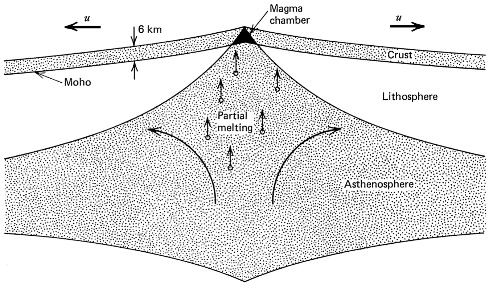
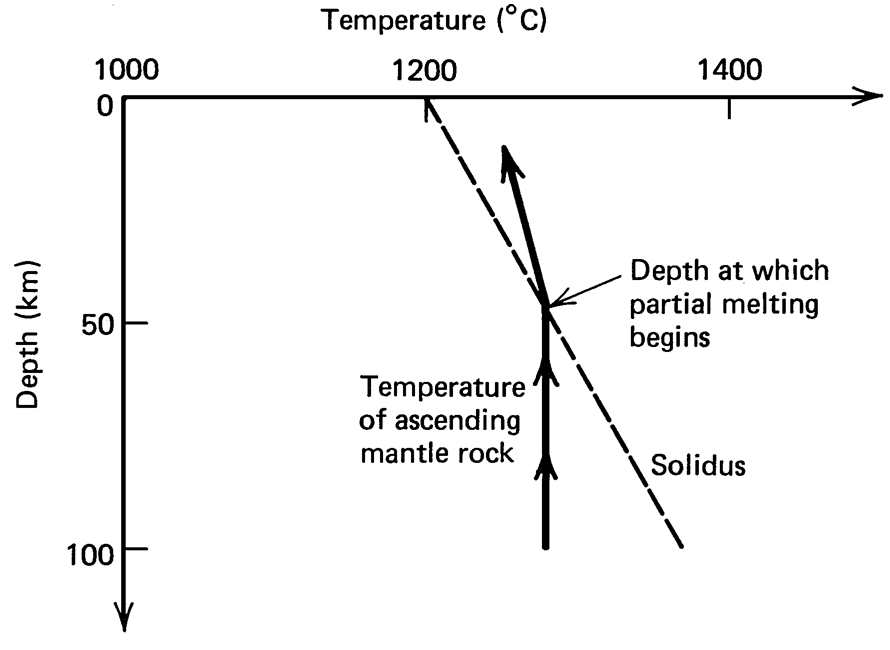

## Goals of this lesson

- Present divergent (accreting) plate boundaries

## Plate boundaries

- Three different principal types of plate boundaries

    - Divergent (accreting)
    - Convergent (subduction)
    - Transform

## Plate boundaries

- Three different principal types of plate boundaries

    - **[Divergent (accreting)]{style="color:teal;"}**
    - Convergent (subduction)
    - Transform

## Divergent plate boundaries {.smaller}

{height="300"}

- Plate boundary where new plates form and with **[divergent motion]{style="color:teal;"}**
- Thermal buoyancy produces topographic highs near spreading ridges, which decrease away from the ridge
- Typical spreading rates: 4 cm per year

## Divergent plate boundaries {.smaller}

:::: {.columns}

::: {.column width="40%"}
{height="300"}
:::

::: {.column width="60%"}
- Plate accretion occurs via **[decompression melting]{style="color:teal;"}**, where the nearly isothermal asthenosphere ascends beneath a spreading center and crosses the solidus for basalt
:::

::::

## Divergent plate boundaries {.smaller}

::::: {.panel-tabset}

### Question

::::: {.columns}

:::: {.column width="40%"}
{height="300"}
::::

:::: {.column width="60%"}


- Assume a simple linear solidus
  \begin{equation} T(K) = 1500 + 0.12 p \end{equation}
  where $T(K)$ is the temperature in Kelvins and $p$ is pressure in MPa

::: {.incremental}
- If we assume the density of the rising asthenosphere is $\rho = 3300$ kg m<sup>-3</sup>, $g = 10$ m s<sup>-2</sup> and a constant temperature of 1600 K, **[at what depth $y$ does the asthenosphere begin to melt?]{style="color:teal;"}** *Note: Pressure $p = \rho g y$ and needs to be scaled by $1 \times 10^{-6}$ to have units of MPa*.
:::

::::

:::::

### Solution

To solve for the unknown depth, we need to rearrange our equation to be able to solve for $y$. For this, we first need to substitute in $p = 1 \times 10^{-6} \rho g y$.

\begin{equation}
T(K) = 1500 + 0.12 \times 10^{-6} \rho g y
\end{equation}

Now we can rearrange.

\begin{equation}
y = \frac{T(K) - 1500}{0.12 \times 10^{-6} \rho g}
\end{equation}

We can calculate $y$ in Python using the values $T(K) = 1600$, $\rho = 3300$, and $g = 10$.

```{python}
#| echo: true

y = (1600 - 1500) / (0.12 * 3300 * 10 * 1e-6)
print(f"The decompression depth is {y:.1f} m or {y/1000:.1f} km.")
```

:::::

## Divergent plate boundaries {.smaller}

{height="300"}

- Divergent plate movement here is a form of gravitational sliding driven in part by the **[ridge push force $F_{\mathrm{RP}}$]{style="color:teal;"}** owing to the high elevations of the ridge relative to the majority of the oceanic plate

{{< arrow from="500,155" to="410,195" width="5" size="5" color="teal" position="absolute" label=$F_{\mathrm{RP}}$ >}}

{{< arrow from="550,155" to="640,195" width="5" size="5" color="teal" position="absolute" label=$F_{\mathrm{RP}}$ label-offset="-10" >}}

## Age of the oceanic crust {.smaller}

.](img/sea-floor-age.png)

## Test your might

- You can find a quiz about this lesson at https://elomake.helsinki.fi/lomakkeet/62991/lomake.html<br/><br/>

- Please take the quiz to help me know what you have learned
- Your answers are anonymous and will not count in your course grade